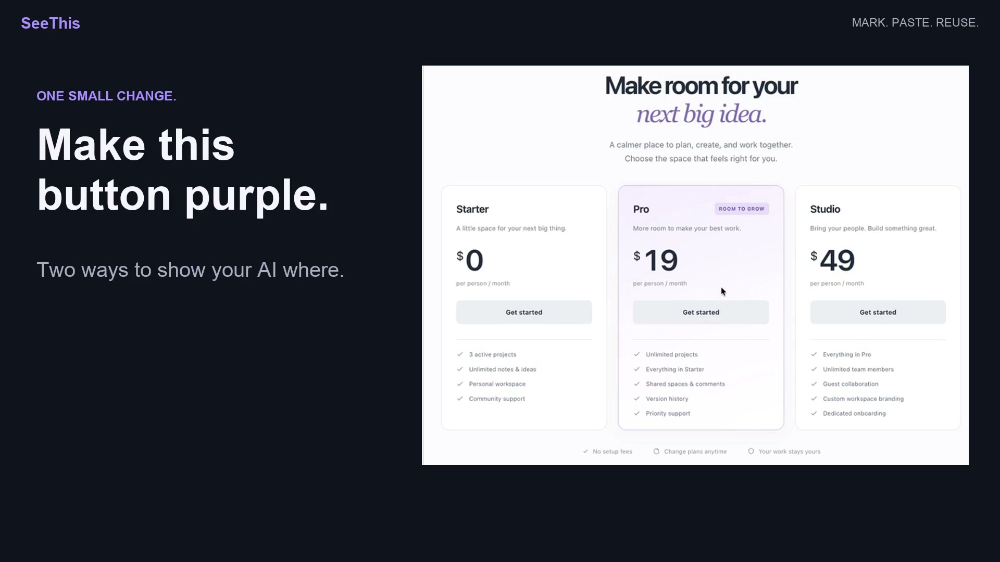

# SeeThis

**Mark what you mean on your Mac, then share it with your assistant.**

SeeThis is a macOS menu bar tool. Hold **Option+A** and draw around one or more areas of your screen. It copies a local reference immediately, and prepares a marked image you can paste into an AI conversation or any app that accepts images.

**[Download v0.1.0-beta.1](https://github.com/amingclawdev/seethis/releases/tag/v0.1.0-beta.1)** · Apple Silicon · macOS 14.2+ · [MIT](LICENSE)

The release app is Developer ID signed and Apple notarized. Choose the DMG or ZIP from the release page and verify it with the accompanying SHA256SUMS.

## How it works

- **Mark several areas at once.** Keep the capture shortcut held while drawing separate regions; release it to create one reference.
- **Choose a reference in Inspector.** Its dropdown shows a name and time. New captures select the newest reference; deleting one selects the newest remaining item.
- **Share a local reference or an image.** Copy JSON URL for a tool on the same Mac. Choose Copy marked image to copy the annotated image explicitly.
- **Return to the right context.** Live marks belong to their original app/window and, in standalone Google Chrome, their tab/page.
- **Delete with Option+D.** Hold the delete shortcut and click mark boundaries, or delete the selected reference in Inspector.

Option+A and Option+D are the defaults. If you change them in Open Settings…, use the shortcuts shown in Inspector.

## Quick start

1. Download the DMG or ZIP and SHA256SUMS from the release page, and compare the downloaded file's SHA-256 with the published checksum. Put SeeThis.app in Applications and open it.
2. Allow **Input Monitoring** and **Screen Recording** for that copy of SeeThis in System Settings → Privacy & Security. Use the menu's permission-settings shortcuts and Retry Input Monitoring as needed; quit and reopen the exact app if macOS requires it.
3. On a screen with safe test content, hold **Option+A**, drag around an area with the left mouse button, then release the shortcut. A local JSON URL is copied immediately; the image finishes in the background.
4. Open **Show Inspector…** from the menu. Once the image is ready, choose **Copy marked image**, inspect it, and paste or attach it to your conversation.

For Chrome page context, activate standalone Google Chrome. When Automation is missing or denied, Inspector shows **Connect Chrome**, **Retry Chrome** and **Automation Settings…**. Connect Chrome requests access explicitly. Merely opening Inspector, starting in the background or using an already authorized Chrome session does not trigger that recovery flow.

The app lives in the menu bar; there is no main window. Inspector is a movable panel with a fixed 470 × 430-point size. Feedback… opens an email draft; you decide whether to send it.

## Demo

[Landscape demo (16:9, 76 seconds)](docs/demo/SeeThis-landscape-v3-public.mp4) · [Portrait alternative (3:4)](docs/demo/SeeThis-portrait-v3-public.mp4)

The demo is edited for clarity, with private links and personal content redacted. It shows an earlier recorded workflow; the current Inspector uses the reference dropdown described above. The footage does not certify the release build or another Mac. See [media attribution](THIRD_PARTY_NOTICES.md).

## Sharing and privacy

A `127.0.0.1` reference URL works only for tools on the **same Mac**, while SeeThis is running and the reference is valid. Web chats, remote assistants and other computers need an explicitly pasted or attached image. SeeThis does not upload your screen to a cloud service.

**A capture includes the entire selected display. Marks are not a privacy crop.** Hide private windows and notifications before capturing, and inspect the whole image before sharing it. Deleting a reference cannot retract images already shared, clipboard copies or backups. Do not post capability URLs or settings access addresses in public issues. [Privacy details (中文)](PRIVACY.md) · [Security reports](SECURITY.md)

## Guides and development

The detailed usage guides are currently available in Chinese:

- [Installation and permissions (中文)](docs/INSTALL.md)
- [Capture, Inspector, copying and deletion (中文)](docs/USAGE.md)
- [Google Chrome and Automation (中文)](docs/CHROME.md)
- [Recovery, manual updates, uninstalling and feedback (中文)](docs/TROUBLESHOOTING.md)
- [Building and contributing (中文)](CONTRIBUTING.md)

[Contributing (中文)](CONTRIBUTING.md) · [Changelog](CHANGELOG.md) · [Release notes and checksums](docs/RELEASE.md) · [Dependency and media notices](THIRD_PARTY_NOTICES.md)

This beta is for Apple Silicon on macOS 14.2 or later. Intel builds, automatic updates and App Store distribution are not available. See the release notes for known verification limits.
